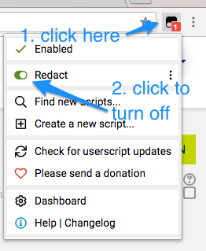
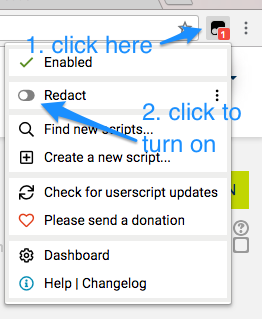

## Chrome Installation Instructions

1. Install Tampermonkey from the [Chrome Web Store](https://chrome.google.com/webstore/detail/tampermonkey/dhdgffkkebhmkfjojejmpbldmpobfkfo "Greasemonkey").  
2. Next, [install Redact](https://raw.githubusercontent.com/damoclark/Redact/cqu/Redact.user.js).

And the installation is done!

## Google Chrome Redact Usage

Once you have installed Redact it will automatically active when you navigate to a CQUniversity website such as Moodle or AIMS.  To turn the redaction off:

Click the black button, and then turn the switch off

Now just reload the page.

If you wish to turn it back on again, then do the reverse:

