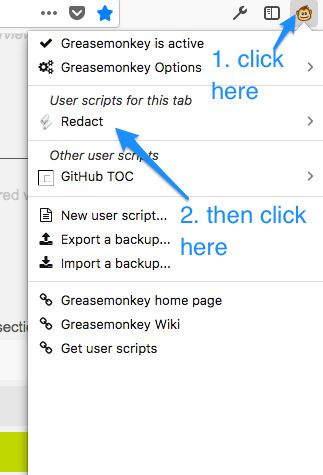
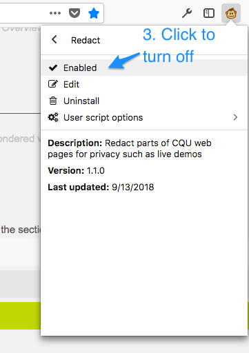
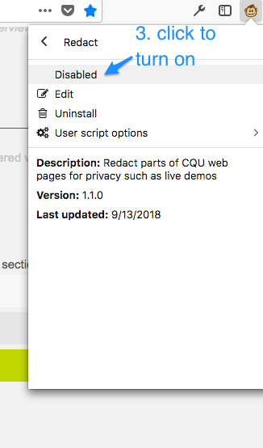

## Firefox Installation Instructions

1. Install CQUniversity’s Moodle Activity Viewer (MAV) from the  [MAV Install Page](https://indicators.cqu.edu.au/mav/ "Moodle Activity Viewer").  
2. Next, [install Redact](https://raw.githubusercontent.com/damoclark/Redact/cqu/Redact.user.js).

And the installation is done!

## Mozilla Firefox Redact Usage

Once you have installed Redact it will automatically active when you navigate to a CQUniversity website such as Moodle or AIMS.  To turn the redaction on or off:

Click the Monkey button, and then click _Redact_: 

Now to turn off:

Now just reload the page.

If you wish to turn it back on again, then do the reverse:

